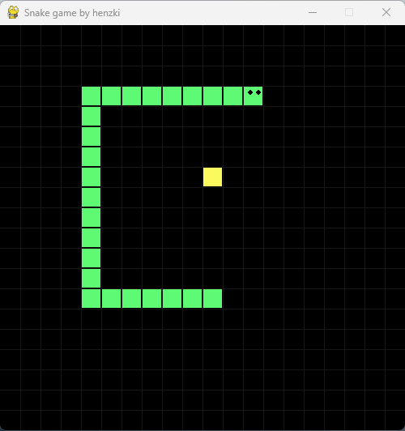

# Snake game with Pygame

A traditional snake game. The game involves controlling a snake that grows length by collecting snacks. The game becomes more difficult when the snake gets longer because the game ends when the snake hits itself.

---

Tutorial: [Snake Pygame Tutorial with Tech With Tim](https://www.youtube.com/watch?v=5tvER0MT14s)
